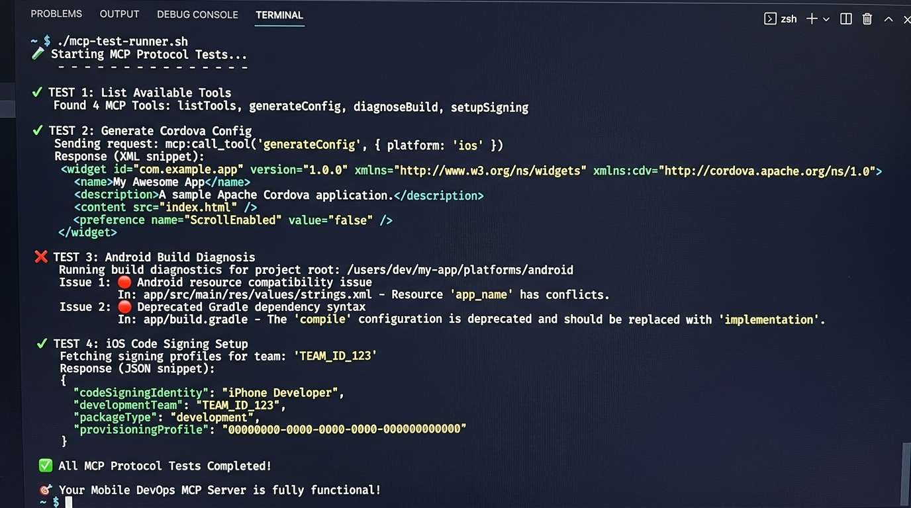

# 📱 Mobile DevOps MCP Server

[](https://www.npmjs.com/package/mobile-devops-mcp)
[](https://opensource.org/licenses/MIT)

> An MCP server exposing mobile DevOps workflows as agent-callable tools — config generation, build diagnostics, and code signing for Cordova/PhoneGap projects.

**The problem:** Mobile builds break in ways that waste hours — cryptic Gradle errors, SDK mismatches, signing misconfigurations. AI agents can't help because they have no structured access to mobile tooling knowledge. This server gives any MCP-compatible agent (Claude, Cursor, Windsurf, custom) three tools that turn vague build failures into actionable fixes and generate production-ready configs on demand.

---

## Install

Add to your MCP client config (Claude Desktop, Cursor, Windsurf, etc.):

```json
{
  "mcpServers": {
    "mobile-devops": {
      "command": "npx",
      "args": ["-y", "mobile-devops-mcp"]
    }
  }
}
```

That's it — no cloning, no building. The server starts automatically when your MCP client needs it.

---

## Demo

<p align="center">
  
</p>


<details>
<summary><strong>Example: Agent calls <code>generate-cordova-config</code></strong></summary>

**Request:**
```json
{
  "name": "generate-cordova-config",
  "arguments": {
    "appName": "SmythOS Mobile Demo",
    "packageId": "com.smythos.mobile.demo",
    "platforms": ["android", "ios"],
    "minSdkVersion": 24
  }
}
```

**Response (generated `config.xml`):**
```xml
<?xml version='1.0' encoding='utf-8'?>
<widget id="com.smythos.mobile.demo" version="1.0.0" xmlns="http://www.w3.org/ns/widgets">
    <name>SmythOS Mobile Demo</name>
    <description>SmythOS Mobile Demo - Built with Mobile DevOps MCP Server</description>

    <author email="dev@company.com" href="https://company.com">Development Team</author>
    <content src="index.html" />

    <!-- Global Preferences -->
    <preference name="permissions" value="none" />
    <preference name="orientation" value="default" />
    <preference name="target-device" value="universal" />
    <preference name="fullscreen" value="true" />
    <preference name="webviewbounce" value="true" />

    <!-- Android Preferences -->
    <preference name="android-minSdkVersion" value="24" />
    <preference name="android-targetSdkVersion" value="35" />
    <preference name="android-installLocation" value="auto" />

    <platform name="android">
        <preference name="AndroidWindowSplashScreenAnimatedIcon" value="res/screen/android/splash.png" />
        <preference name="AndroidWindowSplashScreenBackground" value="#ffffff" />
        <icon density="ldpi" src="res/icon/android/icon-36-ldpi.png" />
        <icon density="mdpi" src="res/icon/android/icon-48-mdpi.png" />
        <icon density="hdpi" src="res/icon/android/icon-72-hdpi.png" />
        <icon density="xhdpi" src="res/icon/android/icon-96-xhdpi.png" />
        <icon density="xxhdpi" src="res/icon/android/icon-144-xxhdpi.png" />
        <allow-intent href="market:*" />
    </platform>

    <platform name="ios">
        <preference name="deployment-target" value="15.0" />
        <preference name="target-device" value="universal" />
        <icon height="57" src="res/icon/ios/icon-57.png" width="57" />
        <icon height="114" src="res/icon/ios/icon-57-2x.png" width="114" />
        <icon height="72" src="res/icon/ios/icon-72.png" width="72" />
        <icon height="144" src="res/icon/ios/icon-72-2x.png" width="144" />
        <icon height="180" src="res/icon/ios/icon-60-3x.png" width="180" />
        <allow-intent href="itms:*" />
        <allow-intent href="itms-apps:*" />
    </platform>

    <access origin="https://*" />
    <allow-navigation href="https://*" />
</widget>
```
</details>

<details>
<summary><strong>Example: Agent calls <code>diagnose-android-build</code></strong></summary>

**Request:**
```json
{
  "name": "diagnose-android-build",
  "arguments": {
    "errorLog": "AAPT: error: resource android:attr/lStar not found. Could not find method compile() for arguments",
    "gradleVersion": "7.4",
    "targetSdkVersion": 35
  }
}
```

**Response:**
```
🔧 Android Build Diagnosis Report

• 🔴 Android resource compatibility issue (compileSdkVersion mismatch)
  → Update compileSdkVersion to 31+ in build.gradle and add
    android:exported="true" to all <activity>, <service>, and <receiver>

• 🔴 Deprecated Gradle dependency syntax
  → Replace "compile" with "implementation" and "testCompile"
    with "testImplementation" in all build.gradle files

Environment:
• Gradle: 7.4
• Target SDK: 35
```
</details>

<details>
<summary><strong>Example: Agent calls <code>setup-ios-signing</code></strong></summary>

**Request:**
```json
{
  "name": "setup-ios-signing",
  "arguments": {
    "certificateType": "distribution",
    "bundleId": "com.smythos.mobile.demo",
    "teamId": "ABCD123456"
  }
}
```

**Response (generated `build.json`):**
```json
{
  "ios": {
    "release": {
      "codeSignIdentity": "iPhone Distribution",
      "developmentTeam": "ABCD123456",
      "packageType": "app-store",
      "provisioningProfile": "AUTO"
    }
  }
}
```

**Step-by-step instructions:**
1. Open Xcode → Settings → Accounts
2. Add your Apple ID and select team: ABCD123456
3. Download distribution certificates
4. Create distribution provisioning profile for com.smythos.mobile.demo
5. Save the build.json configuration in your project root
6. Build with: `cordova build ios --release --device`
7. Verify signing in Xcode → Signing & Capabilities
8. Test on a physical device before submission
</details>

---

## Tools

| Tool | What it does |
|------|-------------|
| `generate-cordova-config` | Generates a production-ready `config.xml` with platform-specific icons, splash screens, SDK targets (Android 24–35, iOS 15.0+), and HTTPS-only access origins. All inputs validated with Zod; all output XML-injection-safe. |
| `diagnose-android-build` | Pattern-matches against **14 known Android build failures** (SDK mismatches, Gradle deprecations, AAPT2, multidex, manifest merging, Kotlin conflicts, cleartext, missing env vars, …) and returns severity-tagged issues with fix commands. |
| `setup-ios-signing` | Generates a `build.json` for development / distribution / ad-hoc signing, maps certificate types to `codeSignIdentity` and `packageType`, and outputs step-by-step Xcode instructions. |

---

## Architecture

```
src/
├── tools/                    # Shared tool layer (single source of truth)
│   ├── xml-utils.ts          # XML escaping to prevent injection
│   ├── cordova-config.ts     # Cordova config generator + Zod schema
│   ├── android-diagnostic.ts # Android build diagnostic (14 patterns)
│   ├── ios-signing.ts        # iOS code signing helper + Zod schema
│   └── index.ts              # Barrel export
├── index.ts                  # SmythOS Agent entry point
└── mcp-server.ts             # Standalone MCP Server (stdio transport)
```

Both entry points consume the shared `tools/` layer — zero logic duplication between the MCP server and the SmythOS agent.

### MCP Protocol Details

- **Transport:** stdio (standard MCP)
- **Schemas:** `ListToolsRequestSchema` / `CallToolRequestSchema` from `@modelcontextprotocol/sdk`
- **Validation:** All inputs pass through Zod schemas before execution
- **Error handling:** Failures return `{ isError: true }` with a descriptive message

---

## Development

**Requirements:** Node.js 18+

```bash
# Clone and install
git clone https://github.com/balakrishna5639/mobile-devops-mcp.git
cd mobile-devops-mcp
npm install

# Run the MCP server locally (stdio)
npm run mcp

# Run unit tests (53 tests across 4 suites)
npm test

# Run MCP protocol integration test
npm run test-mcp

# Build for production
npm run build
```

---

## Testing

```
 ✓ src/tools/__tests__/xml-utils.test.ts         (8 tests)
 ✓ src/tools/__tests__/cordova-config.test.ts     (13 tests)
 ✓ src/tools/__tests__/android-diagnostic.test.ts (21 tests)
 ✓ src/tools/__tests__/ios-signing.test.ts        (11 tests)

 Test Files  4 passed (4)
      Tests  53 passed (53)
```

---

## License

MIT